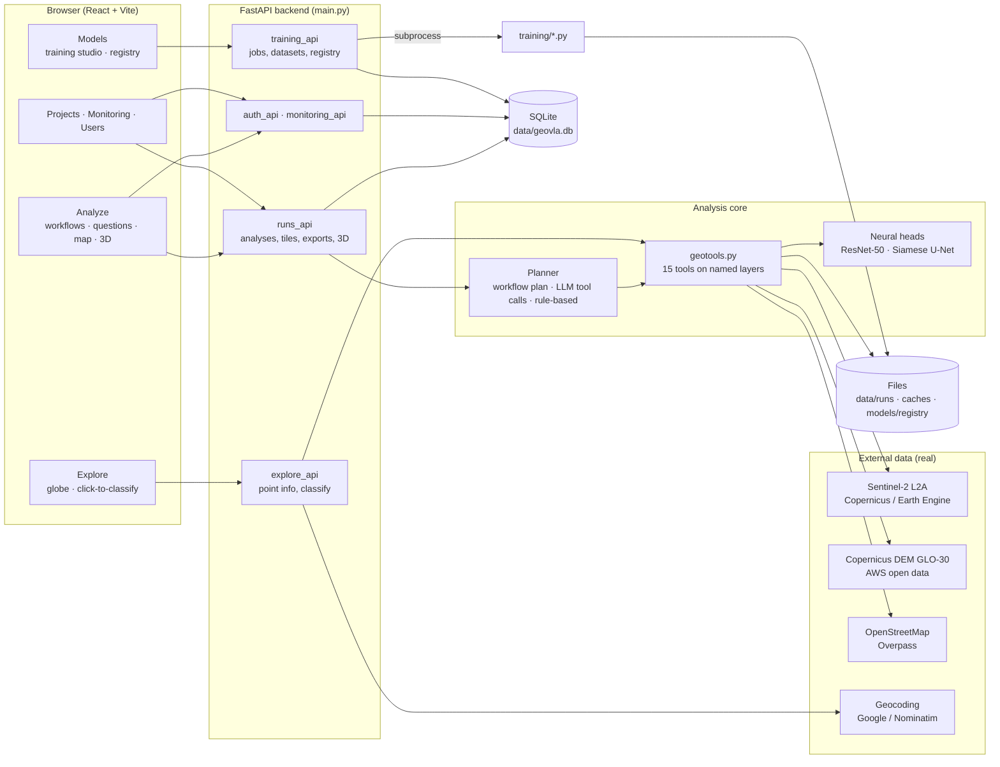
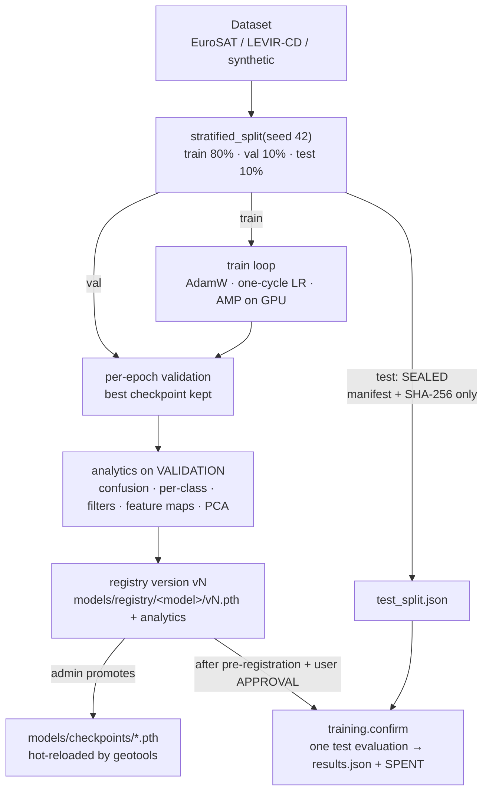

# Geo-VLA architecture

A living description of how the system works, end to end: what happens when someone runs an analysis, where
every number comes from, how users are handled and how the neural networks are trained and checked. It also
records design decisions (adopted and rejected, with reasons), results and open gaps. Update it in the same change
as the code it describes.

Last updated: 2026-09-25.

---

## 1. The system in one picture



Three kinds of work flow through the system:

1. **Analyses** (Analyze page, monitors): a request becomes a *run*, a chain of tool calls over real satellite,
   elevation and map data, producing layers, figures, a PDF and exports.
2. **Exploration** (Explore page): a single clicked point is described (address, elevation) and the land-cover
   network is run on the surrounding Sentinel-2 patches, with an explanation of what it looked at.
3. **Training** (Models page, command line): a dataset becomes a trained checkpoint with analytics, a registry
   version, and after promotion the model used by every analysis.

---

## 2. An analysis, step by step

```mermaid
sequenceDiagram
    participant UI as Browser
    participant API as runs_api
    participant RUN as services/runs.py
    participant PL as planner / agent
    participant T as geotools
    participant EXT as Copernicus · AWS · Overpass
    participant ST as storage + DB

    UI->>API: POST /runs {bbox, workflow + params | instruction}
    API->>RUN: create row (status queued), return id immediately
    RUN->>RUN: background thread (max MAX_CONCURRENT_RUNS)
    RUN->>PL: plan: fixed workflow steps, or LLM tool calls
    loop each tool call
        PL->>T: run_tool(name, inputs)
        T->>EXT: fetch Sentinel-2 / DEM / OSM (cached on disk)
        T-->>PL: result JSON; layer stored in the run workspace
        RUN->>ST: append trace step (UI polls and shows it live)
    end
    RUN->>ST: save layers (npz), styles, insights, status done
    UI->>API: GET /runs/{id}, tiles, report.pdf, export.zip
```

- **Request.** Either a *workflow* (fixed, parameterised tool chain from `services/workflows.py`, used for anything
  that may go into an official record) or a free-text *instruction* for the AI agent.
- **Planning.** `agent.py` runs an LLM tool-calling loop over the 15 tool schemas (Groq, OpenRouter, Together,
  Ollama, any OpenAI-compatible server, or Anthropic; chosen in `config.llm_settings()`). With no LLM key,
  `planner.py` produces a rule-based plan. Workflows never need an LLM.
- **Tools** (`geotools.py`) never pass raw arrays to the planner. They read and write **named layers** in a
  per-run `Workspace` (`s2_2024-07-01`, `dem`, `landcover_2024-07-01`, `forest_loss` ...) and return small JSON
  results. That keeps the reasoning trace readable and the LLM context small.
- **Outputs.** Each layer is saved under `data/runs/<id>/`, styled once (`rendering.py`) and shared by map tiles,
  previews and the PDF. `services/insights.py` builds the key figures and charts; `services/reports.py` the PDF;
  `services/exports.py` GeoTIFF / GeoJSON / ZIP.

---

## 3. Data: where it comes from and how it is handled

| Source | Used for | Access | Key needed | Cache |
|---|---|---|---|---|
| **Sentinel-2 L2A** (B02, B03, B04, B08 at 10 m) | Imagery, NDVI, land cover, change | Copernicus Process API (least-cloud mosaic) or Google Earth Engine (cloud-masked median) | `COPERNICUS_CLIENT_ID/SECRET` or `EE_PROJECT` | `data/imagery_cache/*.npz` |
| **Copernicus DEM GLO-30** | Elevation, slope, flood model, 3D | Cloud-optimised GeoTIFFs on AWS open data, every 1° tile the area touches, mosaicked, seams filled | none | `data/dem_cache/*.npz` |
| **OpenStreetMap** | Rivers, lakes, roads, buildings | Overpass API; tries several public servers, fails over on 429/5xx/timeouts | none | `data/osm_cache/*.json` |
| **Geocoding** | Place search, clicked-point address | Google Geocoding API, else Nominatim, else bundled gazetteer | optional `GOOGLE_MAPS_API_KEY` | none |
| **Basemaps / globe** | Map backgrounds, 3D | Esri World Imagery, OSM, CARTO; Cesium ion terrain and Google Photorealistic 3D tiles | optional `CESIUM_ION_TOKEN` | browser |
| **EuroSAT RGB** | Training the land-cover classifier | Zenodo download (`training.download_data`) | none | `data/eurosat/` |
| **LEVIR-CD** | Training the change detector | Manual download, then `training.download_data levir --from <zip>` | none | `data/levir_cd/` |

**Real by default.** `GEO_VLA_DATA_MODE=live` is the default: elevation and OpenStreetMap are always fetched for
real. Sentinel-2 needs Copernicus or Earth Engine credentials; without them an imagery step fails with a message
naming the missing variables, and the top bar shows `S2 no key`. It never silently substitutes synthetic imagery,
because mixing a synthetic scene with a real DEM would produce spatially meaningless results.

**Synthetic world** (`synthetic.py`): a deterministic fake landscape used only when `GEO_VLA_DATA_MODE=synthetic`
or `GEO_VLA_OFFLINE=1` (automated tests, a demo without internet). Every result produced from it is labelled
"demonstration data" in the UI and in the PDF.

**Grids and units.** Every raster covers the run's bbox on an EPSG:4326 grid sized by `geo_utils.grid_shape`
(about 10 m for imagery, 30 m for the DEM, clamped to 64-768 px). Tools align layers to each other before combining
them. Areas are computed with the latitude-corrected pixel size, so km² figures stay correct away from the equator.

**Secrets.** Keys live only in `.env` (git-ignored). The browser receives only the keys meant for it (Cesium ion,
Google Map Tiles) through `GET /client-config`.

---

## 4. Users and access

| Role | How created | Can |
|---|---|---|
| Visitor | not signed in | run analyses and questions, view results, download reports; results expire after `ANON_RUN_TTL_HOURS` |
| public | self sign-up (`ALLOW_PUBLIC_SIGNUP`) | + saved projects, history, share links |
| official | created or upgraded by an admin | + monitored areas and alerts |
| admin | first one from `ADMIN_USERNAME/ADMIN_PASSWORD` at startup | + training studio, model registry, user management |

- Passwords: scrypt with a random salt (`services/auth.py`). Sessions: random bearer tokens; only their SHA-256 is
  stored (`sessions` table), revoked when a user is deactivated or their password is reset.
- Analyses are private to their owner unless shared through an unguessable, revocable share token. Tiles and
  downloads accept the owner's token or `?share=`.
- Database tables (`services/db.py`): `users`, `sessions`, `projects`, `runs`, `monitors`, `alerts`,
  `training_jobs`, `model_versions`.

---

## 5. Neural networks: training, registry, inference

### 5.1 The two models

| Model | Architecture | Task | Training data | Used by |
|---|---|---|---|---|
| Land-cover classifier | ResNet-50 (ImageNet init), final layer -> 10 classes | label a 640 m patch (64x64 px at 10 m) | EuroSAT RGB | `classify_scene`, Explore click-to-classify, every land-cover workflow |
| Change detector | Siamese U-Net, shared ResNet encoder, \|f1 - f2\| to the decoder (FC-Siam-diff) | per-pixel change mask between two dates | LEVIR-CD | `detect_change` |

Without a promoted checkpoint the tools fall back to classical methods (spectral rules, change-vector analysis),
and the trace says so.

### 5.2 Training pipeline



- Entry points: the Models page (jobs run as subprocesses with JSON-lines progress), `python -m training.pipeline`
  (same job system, command line), or the standalone scripts `training/train_classifier.py` and
  `training/train_change_detector.py`.
- Every run records dataset statistics, the architecture (every layer's output shape and parameter count),
  per-batch loss, accuracy, learning rate and gradient norm, per-epoch curves, and the evaluation analytics.
- **Registry** (`services/training.py`): each finished job becomes version `vN` with its metrics and analytics.
  Promotion copies it atomically to `models/checkpoints/`, writes a sidecar with the version and training input
  size, and hot-reloads the model without a restart. The version appears in every result's method line and in
  the PDF.
- Hardware: training uses CUDA automatically (mixed precision). On the development laptop (RTX 5070 Ti, 12 GB)
  ResNet-50 at 224 px trains at about 330 images/s using 3.4 GB.

### 5.3 Evaluation integrity: the sealed test split

The headline accuracy of a model is only trustworthy if it was measured once, on data that played no part in
building or choosing it. The code enforces this:

1. **The split is fixed.** `stratified_split` always splits the *full* dataset with the given seed, so the test
  images never change. Quick subset runs (`--max-samples`) subsample only train and validation; they can never
  draw a test image. (Before 2026-09-25 a subset run could put test images into validation; fixed, with a test.)
2. **Training never loads the test split.** It is identified by a manifest (sorted file ids + SHA-256, written to
  `analytics/test_split.json`) but not opened. All reported training metrics, the confusion matrix and the
  analytics are computed on **validation**. The registry's headline score is validation accuracy / F1.
3. **Pre-registration.** Before any test evaluation, `eval/confirmation/<name>/PREREG.md` states the question,
  metrics and pass bars, and is frozen by `PREREG.md.sha256`. Later changes go in an appended DEVIATIONS section
  and may never loosen a bar.
4. **Approval.** The user's explicit approval is recorded in `APPROVAL.md`, quoting the PREREG hash, the chosen
  checkpoint's hash and the test-split hash.
5. **One shot.** `python -m training.confirm --name <name> --version vN` checks all of the above, evaluates once,
  writes `results.json` (metrics and pass/fail per bar) and `SPENT.json`. A spent split can still be used for
  development, never again for confirmation. Completed confirmation folders are never rewritten
  (`.gitattributes` keeps them byte-exact so the hashes stay valid).

### 5.4 Inference and explanation

- `classify_scene` tiles a Sentinel-2 scene into 64 px patches, resizes each to the training input size, and paints
  the predicted class back as a land-cover map.
- Explore click-to-classify (`services/explorer.py`) fetches a 1.92 km window around the point, classifies the 3x3
  patch grid, and for the centre patch returns softmax probabilities, entropy, a Grad-CAM heatmap (layer4), the
  most active feature maps of every ResNet stage, logits, embedding statistics and the band reflectance signature
  with NDVI/NDWI.

---

## 6. Frontend

- React 19 + Vite; MapLibre GL (2D and terrain), Cesium (globe, Google 3D tiles), Three.js (3D Studio).
- **Design language: flat dark operations console.** Tokens in `frontend/src/styles/tokens.css` (neutral greys,
  one blue accent, status colours only for status, IBM Plex Sans / Mono, 4 px radii, no gradients, glow, blur or
  emoji). Base components in `base.css`; icons from `lucide-react`.
- Styles are split by owner so parallel work never collides: `shell.css` (top bar, layout), `analyze.css`,
  `studio.css`, `globe.css`, `terrain.css`, `pages.css`.
- The top bar shows live system status from `/health`: Sentinel-2 source (or `S2 no key`), LLM provider, active
  CNN version.

---

## 7. How work is done on this repo

Claude leads design, integrity rules and verification; Cursor agents (`cursor-agent -p --model auto`) do bulk work
in separate git worktrees or long runs, and report in JSON files. Every agent result is checked directly (diffs,
hashes, counts, recomputed numbers) before it is merged or reported.

---

## 8. Decisions log

| Date | Decision | Status | Reason |
|---|---|---|---|
| 2026-09-25 | Real data by default; no synthetic fallback for Sentinel-2 in live mode | adopted | results must be real; mixing synthetic imagery with a real DEM is meaningless |
| 2026-09-25 | Overpass: several servers, failover, disk cache | adopted | the public server returned 504 under load; one query took 391 s before failover on timeouts |
| 2026-09-25 | Sealed test split, validation-only training metrics, gated one-shot confirmation | adopted | the old code scored the test split after every run, so it was effectively used for development |
| 2026-09-25 | Flat dark ops-console UI replacing glass/gradient theme | adopted | the old look read as generic AI output; officials need a dense, precise tool |
| 2026-09-25 | Cesium ion (free) for world terrain and Google 3D tiles rather than a direct Google key | adopted | no billing card needed; a Google key remains optional |
| 2026-09-25 | CUDA 13 PyTorch build in the project venv | adopted | the RTX 5070 Ti (Blackwell) needs CUDA 12.8+; the CPU build wasted the GPU |
| earlier | Land cover from 64 px patches rather than one label per scene | adopted | EuroSAT's native scale; one label for a whole scene is meaningless |
| earlier | Change measured mostly via land-cover map comparison, not the LEVIR-CD model | adopted | LEVIR-CD is 0.5 m building change; at 10 m Sentinel-2 it under-detects vegetation change |

---

## 9. Results

| Date | What | Numbers | Where |
|---|---|---|---|
| 2026-09-25 | Real OpenStreetMap, Bellandur Lake (77.64-77.70 E, 12.91-12.96 N) | 158 water features, 564 major roads, 18,936 buildings | live Overpass |
| 2026-09-25 | Real Copernicus DEM, same area | 858-919 m elevation (Bengaluru is ~900 m) | AWS COGs |
| 2026-09-25 | EuroSAT RGB dataset verified | 27,000 images, 10 classes, all 64x64 RGB; file-list SHA-256 75eda203... | `data/eurosat/VERIFY.json` |
| 2026-09-25 | EuroSAT classifier v1, development run (validation only; ResNet-50 ImageNet init, 224 px, 10 epochs, RTX 5070 Ti, 24.7 min) | val accuracy 0.9867, macro-F1 0.9859, lowest class recall 0.970 (HerbaceousVegetation / Pasture); main confusions among vegetation classes. Optimistic: epoch chosen on this split. Promoted. | `data/training_jobs/1/analytics`, registry v1 sha256 6a81f77b... |
| — | EuroSAT test-split confirmation | not run (awaiting approval) | `eval/confirmation/classifier-eurosat/` |

---

## 10. Open gaps

- **Sentinel-2 keys not yet provided**, so imagery-based workflows and click-to-classify cannot run on real data
  until `COPERNICUS_CLIENT_ID/SECRET` are in `.env`.
- **Change detector** has no real training yet: LEVIR-CD must be downloaded manually. It is also the wrong scale for
  Sentinel-2 (0.5 m vs 10 m); fine-tuning on OSCD (10 m) is the right next step.
- **EuroSAT is European imagery**; accuracy on Indian landscapes is UNKNOWN until checked against labelled Indian
  patches.
- Training epochs take ~150 s, not the ~60 s the GPU could manage: on Windows the data loaders run in the main process (the loaders are lambdas, which worker processes cannot receive). Making them picklable would cut EuroSAT training to about 10 minutes.
- LLM planner not yet exercised against a live provider in this environment (needs `GROQ_API_KEY`).
