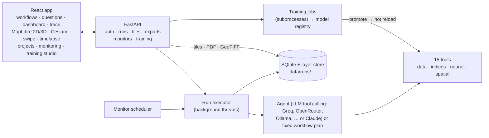

# Geo-VLA

**Satellite analysis for officials and citizens: a tool-augmented vision-language-action platform for geospatial reasoning**

Geo-VLA answers questions about any place on Earth from free satellite data. Pick a
ready-made analysis (flood risk, deforestation, urban growth, crop health, …) or ask in
plain language. The system fetches Sentinel-2 imagery, elevation and OpenStreetMap data,
runs trained vision models and classical geospatial tools in a transparent chain, and
returns the result as:

- a map with full-resolution layers, 3D terrain, a before/after swipe and a timelapse,
- a dashboard of key figures and charts,
- an official PDF report with a GeoTIFF/GeoJSON export for GIS software,
- a step-by-step trace of how every number was produced.

Areas can be **monitored**: Geo-VLA re-checks them on a schedule and raises an alert
when, say, forest loss or lake encroachment crosses a threshold. Administrators
**train, compare and promote** the vision models from the built-in training studio.

Team: R. Yashaswini (RA2311026010090) · T. Vinay Koushik (RA2311026010091)

---

## Quick start

Everything runs with **no keys, no data downloads and no trained models**. Each missing
piece has a clearly labelled fallback: a rule-based planner instead of an LLM, a
synthetic demo world instead of satellite data, and classical algorithms instead of
untrained networks.

**One-command setup** (Python 3.11+, Node 18+). It creates `.venv`, installs PyTorch (the
CPU build when there is no NVIDIA GPU), builds the frontend, copies `.env.example` to
`.env` and downloads EuroSAT:

```bash
git clone https://github.com/koushik2456/Geo-vla.git && cd Geo-vla
bash scripts/setup.sh                      # Windows: powershell -ExecutionPolicy Bypass -File scripts\setup.ps1
```

Then:

```bash
source .venv/bin/activate                  # Windows: .venv\Scripts\activate
# edit .env: ADMIN_PASSWORD=…  and  GROQ_API_KEY=gsk_…  (free at console.groq.com/keys)
python -m training.pipeline                # train both models on synthetic data and promote them (CPU, ~5 min)
uvicorn main:app --port 8000               # open http://localhost:8000
```

For frontend development use `cd frontend && npm run dev` (http://localhost:5173, proxies
the API). Sign in as `admin` with the password from `.env` to reach monitoring, the
training studio and user management. Anyone can run analyses without an account.

### AI agent: free open models

Free-text questions are planned by an LLM with tool calling. Any **OpenAI-compatible**
endpoint works; set one key in `.env` and it is picked up automatically
(`LLM_PROVIDER=auto` tries them in this order):

| Provider | `.env` | Default model | Cost |
|---|---|---|---|
| **Groq** (recommended) | `GROQ_API_KEY` | `llama-3.3-70b-versatile` | Free tier, very fast |
| OpenRouter | `OPENROUTER_API_KEY` | `meta-llama/llama-3.3-70b-instruct` | Free and paid models |
| Together AI | `TOGETHER_API_KEY` | `meta-llama/Llama-3.3-70B-Instruct-Turbo` | Free credits |
| Any OpenAI-compatible server (vLLM, LM Studio, LiteLLM) | `LLM_BASE_URL`, `LLM_API_KEY` | set `LLM_MODEL` | Self-hosted |
| Ollama (fully local, offline) | `OLLAMA_URL=http://localhost:11434/v1` | `qwen2.5:7b` | Free |
| Anthropic Claude | `ANTHROPIC_API_KEY` | `claude-sonnet-5` | Paid |

Override the model with `LLM_MODEL` (e.g. `qwen/qwen3-32b` on Groq) or force a provider
with `LLM_PROVIDER=groq`. The header chip shows which planner is active (`AI · groq`, or
`Offline planner`). The agent loop sends the 15 tools as function schemas, runs each
call the model makes, returns the result, and repeats. It also recovers from the
occasional malformed tool call that smaller open models produce, and shows any
`<think>` reasoning in the trace panel. Workflows never need an LLM.

## Who it's for

| Role | Can |
|---|---|
| **Visitor** (not signed in) | Run workflows and questions, view maps and dashboards, download reports. Results expire after 24 h. |
| **Public** (self sign-up) | Everything above, plus saved projects, history and public share links. |
| **Official** (created or upgraded by an admin) | Everything above, plus **monitored areas and alerts**. |
| **Admin** | Everything, plus the **training studio**, the model registry and user management. |

## Sector workflows

Fixed, parameterised tool chains, so the same inputs always use the same method. That
matters when numbers go into official records. Dates accept `2024-06-01` or relative
values such as `-3y` and `-45d`, which is what lets a monitor always look at the latest
period.

| Sector | Workflow | Answers | Alertable metrics |
|---|---|---|---|
| Disaster | **Flood risk** | Flooded area, settlements, cropland and km of road at risk for a water rise | `flooded_km2`, `built_up_at_risk_km2`, `roads_flooded_km` … |
| Disaster | **Flood scenarios** | Exposure curve across several water levels | `max_flooded_km2` … |
| Disaster | **Damage assessment** | What changed between pre- and post-event imagery; built-up, cropland and roads affected | `changed_km2` … |
| Forest | **Deforestation** | Forest lost between two dates, near rivers if wanted, slope of cleared land | `forest_loss_km2` … |
| Forest | **Vegetation trend** | Year-by-year NDVI and forest cover, with a timelapse | `ndvi_change` … |
| Urban | **Urban growth** | New built-up land and the green cover it replaced | `new_built_up_km2` … |
| Urban | **Lake & river encroachment** | New construction inside a protection zone around water, and water bodies that shrank | `encroachment_km2`, `water_loss_km2` |
| Agriculture | **Crop health** | Stressed cropland (low NDVI) | `stressed_cropland_km2` … |
| Agriculture | **Crop season profile** | Monthly cropland NDVI through kharif or rabi, with a timelapse | `peak_ndvi` … |

**Free-text questions** go to the AI agent (an open LLM such as Llama 3.3 on Groq, using tool calling), which composes the
same 15 tools freely. Example: *"Which built-up areas would flood if the river rises 6 m,
and how many km of road are affected?"*

## Maps and rendering

- **Full-resolution tiles:** every raster layer is served as XYZ map tiles, resampled
  from the stored data, so detail stays at source resolution (10 m imagery, 30 m DEM)
  at any zoom.
- **2D map and 3D terrain** (MapLibre GL; free AWS terrain tiles, no token): results
  drape over the relief with hillshade.
- **3D Studio** (Three.js), built from the run's DEM and result layers, with four modes:
  - **Surface**: satellite or result layer draped on the relief, with a skirted base, a
    coordinate bounding box and a snapshot button.
  - **Hypsometric**: an elevation colour ramp with labelled contour lines.
  - **Contours**: colourful contour lines at a round interval with labels, in the style
    of a CAD survey drawing.
  - **Stack**: an exploded view of the layers a model sees, labelled ALL / HEIGHT /
    NORMAL / AO (combined render, height map, normal map, ambient occlusion). A slider
    sets the spacing.

  The textures are also served individually (`/runs/{id}/terrain/{kind}.png`).
- **Globe** (Cesium). With a free Cesium ion token, flood layers become a 3D water
  surface. Its height is calibrated against the terrain along the flood boundary, which
  removes the geoid/ellipsoid offset between the Copernicus DEM and Cesium terrain.
- **Before/after swipe** between any two layers (e.g. the two dates of a deforestation run).
- **Timelapse player** for time-series workflows (imagery, NDVI or land cover per date).
- **Place search:** OpenStreetMap Nominatim, plus a bundled offline list of Indian
  cities, lakes, forests and flood- or landslide-prone areas.

## Reports and exports

- **PDF report:** title block, area, request, a map with legend, coordinates, scale bar
  and north arrow, key figures, findings, charts, the full method (every tool call with
  inputs), data sources, models, limitations, and prepared-by / verified-by sign-off lines.
- **GeoTIFF** for every raster (EPSG:4326). Imagery is 4-band surface reflectance ×10000.
  Masks are 0/1. Land cover is class codes, with names in the metadata.
- **GeoJSON** for vector layers, plus masks and land-cover maps vectorised to polygons
  with `area_km2`.
- **ZIP** containing all of the above plus `summary.json` (answer, metrics, full trace).

## Monitoring and alerts

Officials save an area plus a workflow plus a rule, for example *"forest_loss_km2 > 0.5,
checked weekly"*. A background scheduler re-runs due monitors. Every check is stored as
an analysis, the metric history appears as a sparkline, and an alert fires when the rule
triggers. Alerts show up in the app (bell icon), and optionally by email (`SMTP_*`) and
webhook (`ALERT_WEBHOOK_URL`, e.g. Slack or Teams).

## Training studio

Admins can:
- **train** either model from the UI. Jobs run as subprocesses with live progress:
  per-batch loss, accuracy, learning rate and gradient norm, per-epoch train/validation
  curves, and the log.
- **inspect everything about the network and the data**. Each job records:
  - *Dataset*: class counts per split, per-channel mean/std, RGB histograms, per-class
    colour/brightness/greenness statistics, sample grids, change-pixel ratio (LEVIR).
  - *Architecture*: every layer with its output shape and parameter count, total and
    trainable parameters, hyperparameters, loss and optimiser.
  - *Inside the network*: first-layer convolution filters, feature maps of one image at
    several depths, and a 2D PCA of the learned embeddings coloured by class.
  - *Evaluation*: confusion matrix, per-class precision/recall/F1, sample predictions,
    and for change detection a threshold sweep (precision/recall/F1/IoU vs. threshold).
- **compare** versions in the model registry by test accuracy or F1. Analytics stay
  with each registered version.
- **promote** a version to production. It is hot-reloaded without a restart, and the
  model version appears in every result's method line and in the PDF.
- **switch back** to the classical fallback at any time.
- **upload** checkpoints trained elsewhere. Each upload is validated against the
  architecture before it is accepted.

| Dataset | Model | How to get it |
|---|---|---|
| EuroSAT RGB (27,000 patches, 10 classes) | Land-cover classifier (ResNet-50) | `python -m training.download_data eurosat`, run by the setup script, or the *Download* button in the studio |
| LEVIR-CD (637 pairs → 10,192 patches) | Change detector (Siamese U-Net) | Download the zip from [justchenhao.github.io/LEVIR](https://justchenhao.github.io/LEVIR/) (or Kaggle), then `python -m training.download_data levir --from LEVIR-CD.zip` |
| Synthetic (generated) | Both | Always available. Exercises the whole pipeline; the models only suit the demo world. |

### Training pipeline (command line)

`training.pipeline` goes through the same job system as the studio, so every run shows
up there with its curves and analytics, is registered as a new version and is promoted:

```bash
python -m training.download_data status                        # what is available
python -m training.pipeline                                     # quick: both models, synthetic data
python -m training.pipeline --real                              # EuroSAT (+ LEVIR-CD if imported); GPU recommended
python -m training.pipeline --model classifier --dataset eurosat --max-samples 3000 --img-size 64 --epochs 6   # EuroSAT on a laptop CPU, ~10 min
python -m training.pipeline --model change_detector --dataset levir --epochs 50
```

Other flags: `--batch-size`, `--lr`, `--samples`, `--no-pretrained`, `--no-promote`.
The individual scripts (`python -m training.train_classifier --help`,
`training.train_change_detector`) also work standalone, writing a checkpoint, a
`.metrics.json` and an `analytics/` folder of JSON + PNG figures.

For a free GPU, open **`training/colab_train.ipynb`** in Google Colab (T4). It clones the
repo, downloads the data, runs the pipeline, displays the analytics and zips the
models. Upload the `.pth` in the studio (or copy `models/registry/` across).

## Presenting Geo-VLA

**Neural networks class**: focus on the Training studio.
1. *Dataset explorer*: EuroSAT class balance, the stratified train/val/test split, channel
   statistics and normalisation, RGB histograms, and sample grids. Discuss why forests
   are dark and green-heavy while industrial areas are bright.
2. Start the preset **"Classroom demo (CPU, ~1 min)"**, or an EuroSAT subset run, and
   watch the per-batch loss, gradient norm and learning-rate schedule live (*Jobs & analytics → Training curves*).
3. *Network* and *What it learned* tabs: ResNet-50 layer by layer (output shapes, 23.5 M parameters), transfer
   learning from ImageNet, the conv1 filters (edge and colour detectors), feature maps
   getting more abstract with depth, and the embedding PCA separating the classes.
4. *Evaluation* tab: confusion matrix (e.g. highway vs. river mix-ups), per-class F1, and
   for the Siamese U-Net the threshold sweep and why a weighted BCE + Dice loss is used
   when only a few percent of pixels change.
5. Promote the model and run *Urban growth*: the method line now names the new version.

**Remote sensing class**: focus on the full system.
1. Pick a place (e.g. Bellandur Lake or Wayanad) and run **Deforestation** or
   **Lake & river encroachment**. Walk through the trace: Sentinel-2 L2A mosaic → NDVI →
   land-cover map → masks → overlay → zonal statistics.
2. Explain the bands (B02/B03/B04/B08 at 10 m), NDVI, and the Copernicus DEM (30 m).
3. Show the **3D Studio**: hypsometric tint, contours and the ALL/HEIGHT/NORMAL/AO stack.
   Then the before/after swipe and the timelapse.
4. Run **Flood risk** and show the bathtub model's exposure numbers.
5. Ask a free-text question to show the LLM composing tools, and download the PDF
   report and GeoTIFF to open in QGIS.

Without Copernicus keys everything runs on the labelled synthetic demo world, which is
safe for a live demo with no internet (use `LLM_PROVIDER=none` or Ollama offline).

## Going live with real data

Copy `.env.example` to `.env`:

| Component | Variable(s) | Without it |
|---|---|---|
| AI planner for free-text questions | `GROQ_API_KEY` (free) or another provider, see [AI agent](#ai-agent-free-open-models) | Rule-based planner (workflows are unaffected) |
| Sentinel-2, DEM, OSM (switch together) | `COPERNICUS_CLIENT_ID`, `COPERNICUS_CLIENT_SECRET` (free at [dataspace.copernicus.eu](https://dataspace.copernicus.eu) → *User settings → OAuth clients*) | Synthetic demo world, labelled "demo data" everywhere including the PDF |
| First admin | `ADMIN_USERNAME`, `ADMIN_PASSWORD` | No admin until set |
| Globe terrain + 3D water | `VITE_CESIUM_ION_TOKEN` in `frontend/.env` (free) | Smooth globe (MapLibre 3D terrain needs no token) |
| Alert email / webhook | `SMTP_*`, `ALERT_WEBHOOK_URL` | In-app alerts only |

## Architecture



- **Runs.** `POST /runs` returns immediately; the analysis executes on a worker thread
  and appends to its trace as it goes, and the UI polls to show progress live. When it
  finishes, every layer is saved to disk and the dashboard insights are stored with it.
- **Tools** read and write **named layers** in a per-run workspace (`s2_2024-07-01`,
  `forest_loss`, …). The LLM or workflow chains steps by passing layer ids, never raw
  arrays.
- **Styling** (colour ramps, value ranges, class colours) is computed once per layer
  from the full-resolution data and shared by tiles, previews and the PDF, so colours
  match everywhere.

### Tools

| Tool | Group | What it does |
|---|---|---|
| `fetch_sentinel2_scene` | data | Least-cloud Sentinel-2 L2A mosaic (B02, B03, B04, B08 at 10 m) around a date |
| `fetch_dem` | data | Copernicus DEM GLO-30, mosaicking every tile the area touches (seams filled) |
| `fetch_osm_features` | data | OSM water / major roads / buildings via Overpass |
| `compute_ndvi` | index | (NIR − Red) / (NIR + Red) |
| `compute_slope` | index | Slope in degrees, per-axis pixel size |
| `flood_extent` | index | Bathtub model; level absolute or above the lowest point |
| `classify_scene` | neural | ResNet-50 on 64 px patches → land-cover map |
| `detect_change` | neural | Siamese U-Net change mask between two dates |
| `time_series` | analysis | Indicator (NDVI or class share) across up to 12 dates; feeds the timelapse |
| `threshold_layer` | spatial | Continuous layer → mask |
| `class_mask` | spatial | Class, list or group (built-up, cropland, vegetation, water) → mask |
| `buffer_features` | spatial | Metric buffer around vectors or masks |
| `overlay_layers` | spatial | Intersect / union / difference of masks |
| `zonal_stats` | spatial | Statistics or class mix inside a zone |
| `features_in_zone` | spatial | Count of OSM features and km of line inside a zone |

## API

Interactive docs at `/docs`. The main endpoints:

| Area | Endpoints |
|---|---|
| Accounts | `POST /auth/login`, `/auth/signup`, `/auth/logout`, `GET /auth/me`; admin: `GET/POST /admin/users`, `PATCH /admin/users/{id}` |
| Analyses | `POST /runs` (instruction or workflow + params + bbox), `GET /runs`, `GET/PATCH/DELETE /runs/{id}`, `POST/DELETE /runs/{id}/share`, `GET /share/{token}` |
| Maps & files | `GET /runs/{id}/tiles/{layer}/{z}/{x}/{y}.png`, `/runs/{id}/layers/{layer}.tif`, `.geojson`, `/preview.png`, `/runs/{id}/report.pdf`, `/runs/{id}/export.zip` |
| Projects | `GET/POST /projects`, `PATCH/DELETE /projects/{id}` |
| Catalogue | `GET /workflows`, `GET /geocode?q=`, `GET /tools`, `GET /health` |
| Monitoring | `GET/POST /monitors`, `PATCH/DELETE /monitors/{id}`, `POST /monitors/{id}/check`, `GET /alerts`, `POST /alerts/read` |
| 3D | `GET /runs/{id}/terrain` (heights, contours, stats), `GET /runs/{id}/terrain/{hypsometric,hillshade,normal,ao}.png` |
| Training | `GET /training/datasets`, `POST /training/datasets/{d}/download`, `GET /training/datasets/{d}/explore`, `…/samples.png`, `GET/POST /training/jobs`, `GET /training/jobs/{id}`, `GET /training/jobs/{id}/artifacts/{name}`, `POST …/cancel`, `GET /models`, `GET /models/{m}/versions/{v}/artifacts/{name}`, `POST /models/{m}/versions/{v}/promote`, `POST /models/{m}/deactivate`, `POST /models/{m}/upload`, `DELETE /models/{m}/versions/{v}` |
| Scripts | `POST /query` (synchronous agent run with inline previews; used by the evaluation) |

Private data is protected by bearer tokens. Tiles and downloads accept either the
owner's token or the analysis's share token (`?share=`).

## Security notes

- Passwords are hashed with scrypt. Only SHA-256 hashes of session tokens are stored.
- Sessions are revoked when an account is deactivated or its password is reset.
- Analyses are private to their owner unless shared; share links can be revoked.
  Anonymous analyses are readable only via their unguessable id and expire.
- Before public deployment: set `CORS_ORIGINS`, put the app behind HTTPS, and set a
  strong `ADMIN_PASSWORD`.

## Evaluation

`eval/benchmark.jsonl` holds compound questions annotated with the tools a correct plan
needs. `eval/run_eval.py` reports tool recall, precision, execution success and exact
coverage:

```bash
GEO_VLA_OFFLINE=1 python eval/run_eval.py                  # rule-based baseline
python eval/run_eval.py --planner llm --out eval/results_llm.json   # uses the provider in .env
```

Offline baseline: recall 0.90, precision 0.98, execution success 1.00, exact coverage
0.80. It fails the compositional questions, and measuring whether the LLM planner
closes that gap is the core experiment.

## Where this differs from the original implementation guide

| Guide | Here | Why |
|---|---|---|
| Checkpoints loaded at import | Lazy loading, versioned registry, hot reload, classical fallback | The app works before training, and models can be updated without downtime |
| Single-day, RGB-only Sentinel-2 | ±N-day least-cloud mosaic with NIR | Single days are usually empty or cloudy; NDVI needs NIR |
| One DEM tile at the bbox corner | Mosaic of all tiles, seams filled | Areas crossing a degree line were truncated |
| Fixed 30 m pixel for slope | Per-axis pixel size | Longitude spacing shrinks with latitude |
| "Siamese" U-Net that concatenates both dates | Shared encoder, \|f₁ − f₂\| to the decoder (FC-Siam-diff) | Matches the shared-weights design the guide describes |
| Whole scene resized to 224 px | 64 px patches → land-cover map | EuroSAT's scale; one label per scene is meaningless |
| 6 tools, implicit "last fetched" state | 15 tools with explicit layer ids | Adds NDVI, buffer/overlay, time series and exposure counting |
| One synchronous endpoint | Background runs, accounts, tiles, reports, monitoring, training studio | Needed for a tool people can actually use |

**Known limitation:** LEVIR-CD is 0.5 m aerial imagery of building change, while
Sentinel-2 is 10 m. The change detector under-detects vegetation change at 10 m. The
workflows therefore measure most change by comparing land-cover maps (class masks +
overlay), which works at Sentinel-2 resolution. Fine-tuning on OSCD (10 m) is the
natural next step, and the training studio is ready for it.

## Project structure

```
main.py                 FastAPI app (lifespan: DB, admin bootstrap, scheduler)
agent.py planner.py     LLM tool-calling loop (OpenAI-compatible / Anthropic) · rule-based planner
geotools.py             Workspace, tool registry, 15 tools, layer styling
rendering.py            Colour styles shared by tiles, previews and reports
config.py geo_utils.py synthetic.py
api/                    auth · runs/tiles/exports/projects · workflows/monitoring · training
services/               db · auth · runs · storage · tiles · workflows · insights ·
                        exports · reports (PDF) · geocode · monitoring · training · terrain (3D)
models/                 ResNet-50 classifier · Siamese U-Net change detector
training/               pipeline · dataset download/stats · training scripts · analytics · Colab notebook
scripts/                setup.sh · setup.ps1 (one-command setup)
eval/                   benchmark + harness
frontend/               React + Vite + MapLibre GL + Cesium + Three.js
tests/                  56 tests: tools, agent, API, platform, every workflow, real training job
data/gazetteer.json     offline place list
```

## Tests

```bash
pytest -q        # hermetic: offline mode, temporary storage, no keys
```

## Deployment (free)

The `Dockerfile` builds the frontend and serves everything from one container on `$PORT`
(default 7860), so it runs on a Hugging Face Space (Docker SDK) or Render. Mount a
volume at `/app/data` so the database, analyses and training outputs survive restarts,
and add the keys as secrets.

## Roadmap

- Multilingual interface (Hindi, Tamil, Telugu, Kannada) and answers
- Official corrections of land-cover labels on the map, fed back as training data
- Sentinel-1 SAR for flood mapping through clouds; Landsat for pre-2016 history
- Fine-tune change detection on OSCD; a Prithvi-EO foundation-model backbone
- Postgres/PostGIS and object storage for multi-server deployments
