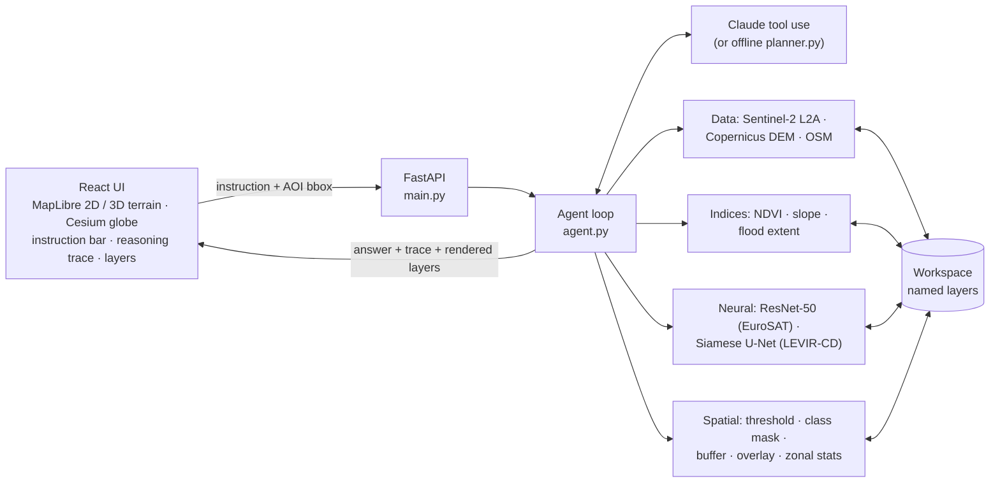

# Geo-VLA

**A Tool-Augmented Vision-Language-Action Model for Geospatial Reasoning**

Geo-VLA turns a natural-language question about a place into a chain of geospatial
tool calls — fetch satellite imagery, run trained vision models, compute terrain and
proximity — and returns a grounded answer, map layers, and a fully transparent
reasoning trace.

> *"Show me where deforestation increased near rivers in the last 3 years and estimate
> terrain slope in those zones."*
>
> → fetch Sentinel-2 (2 dates) → classify land cover ×2 → forest masks → forest loss
> (difference) → fetch OSM rivers → 1 km buffer → loss ∩ buffer → fetch DEM → slope →
> zonal statistics → answer, with every step inspectable in the UI.

Team: R. Yashaswini (RA2311026010090) · T. Vinay Koushik (RA2311026010091)

---

## Quick start (no keys needed)

Every external dependency has a labelled fallback, so the full pipeline runs offline:
a rule-based planner instead of Claude, deterministic synthetic imagery/DEM/OSM
instead of Copernicus, and classical algorithms instead of untrained checkpoints.

```bash
# Backend (Python 3.11+)
python -m venv .venv && source .venv/bin/activate
pip install torch torchvision --index-url https://download.pytorch.org/whl/cpu   # optional: smaller CPU build
pip install -r requirements.txt
uvicorn main:app --reload --port 8000

# Frontend (Node 18+), in a second terminal
cd frontend
npm install
npm run dev          # http://localhost:5173 (proxies API calls to :8000)
```

Or build the frontend once (`npm run build`) and open http://localhost:8000; the
backend serves `frontend/dist` itself.

The status chips at the top of the sidebar show which mode each component is in.

## Going live

Copy `.env.example` to `.env` and fill in whichever parts you want to switch on:

| Component | Variable(s) | Without it |
|---|---|---|
| LLM planner (Claude) | `ANTHROPIC_API_KEY` ([console.anthropic.com](https://console.anthropic.com)) | Offline keyword planner |
| Sentinel-2, DEM, OSM | `COPERNICUS_CLIENT_ID`, `COPERNICUS_CLIENT_SECRET` (free at [dataspace.copernicus.eu](https://dataspace.copernicus.eu) → *User settings → OAuth clients*) | Synthetic data |
| Scene classifier | `models/checkpoints/resnet50_eurosat.pth` | Spectral rules |
| Change detector | `models/checkpoints/siamese_unet_levircd.pth` | Change-vector analysis + Otsu |
| 3D globe terrain | `VITE_CESIUM_ION_TOKEN` in `frontend/.env` (free) | Smooth globe (MapLibre "3D terrain" view needs no token) |

The Copernicus DEM (AWS open data) and OpenStreetMap (Overpass API) need no keys. They
switch to live together with Sentinel-2 (`GEO_VLA_DATA_MODE=auto`), so all layers
describe the same real place. Force a mode with `GEO_VLA_DATA_MODE=live|synthetic`.

## Training the vision heads

Both scripts run on a free Colab T4 / Kaggle P100 (or slowly on CPU) and write a
`*.metrics.json` next to the checkpoint for the report.

```bash
# ResNet-50 land-cover classifier — EuroSAT RGB (27,000 images, 10 classes)
python -m training.train_classifier --epochs 10
#   torchvision downloads EuroSAT automatically; if its mirror is down:
#   --image-folder /path/to/EuroSAT_RGB/2750

# Siamese U-Net change detector — LEVIR-CD (637 pairs → 10,192 patches of 256 px)
#   download from https://justchenhao.github.io/LEVIR/ into data/levir_cd/{train,val,test}/{A,B,label}
python -m training.train_change_detector --epochs 50
```

Restart the backend afterwards; `/health` and the UI chips switch from *fallback* to *trained*.

## Evaluation

`eval/benchmark.jsonl` holds compound geospatial instructions, each annotated with the
tools a correct plan must use. `eval/run_eval.py` runs the agent end to end and reports
tool recall/precision, execution success and exact plan coverage:

```bash
GEO_VLA_OFFLINE=1 python eval/run_eval.py                       # rule-based baseline
python eval/run_eval.py --planner claude --out eval/results_claude.json
```

Offline baseline (synthetic data): tool recall 0.90, precision 0.98, execution success
1.00, exact coverage 0.80. The rules fail on compositional queries (q06: *steep slopes
near roads*; q10: *cropland that would flood*). Measuring whether the LLM planner
closes that gap is the project's core experiment.

## Architecture



1. The user draws an area of interest and types an instruction.
2. `agent.py` sends it, with the 13 tool schemas, to `claude-sonnet-5` through the
   Anthropic Messages API.
3. Claude emits `tool_use` blocks (several in parallel where possible). The agent runs
   each through `geotools.run_tool`, and results go back in one `tool_result` message.
4. Tools read and write **named layers** in a per-request `Workspace` (`s2_2024-07-01`,
   `forest_loss`, …). The LLM chains steps by passing ids, never raw arrays.
5. When Claude stops calling tools, the API returns the answer, the ordered trace
   (reasoning summaries, tool inputs and outputs, timings) and every layer rendered as a
   map overlay.

### Tools

| Tool | Group | What it does |
|---|---|---|
| `fetch_sentinel2_scene` | data | Least-cloud Sentinel-2 L2A mosaic (B02, B03, B04, B08 at 10 m) around a date |
| `fetch_dem` | data | Copernicus DEM GLO-30, mosaicking every 1° tile the bbox touches |
| `fetch_osm_features` | data | OSM water / major roads / buildings via Overpass |
| `compute_ndvi` | index | (NIR − Red) / (NIR + Red) |
| `compute_slope` | index | Slope in degrees, with separate x/y pixel sizes for geographic grids |
| `flood_extent` | index | Bathtub model; water level absolute or above the lowest point |
| `classify_scene` | neural | ResNet-50 on 64 px patches (EuroSAT's native 640 m footprint) → land-cover map |
| `detect_change` | neural | Siamese U-Net change mask between two scenes |
| `threshold_layer` | spatial | Continuous layer → mask (`slope > 15`) |
| `class_mask` | spatial | One land-cover class → mask |
| `buffer_features` | spatial | Proximity zone around vectors (metric buffer in UTM) or around a mask |
| `overlay_layers` | spatial | Intersect / union / difference of masks |
| `zonal_stats` | spatial | Statistics or class mix of a layer inside a zone |

## Where this differs from the implementation guide (and why)

| Guide | Here | Reason |
|---|---|---|
| Model checkpoints loaded at import | Lazy-loaded; classical fallback when missing | The app starts before any training is done |
| Sentinel-2 fetch for a single day, RGB only | ±N-day least-cloud mosaic of B02/B03/B04/B08 | Single-day requests are usually empty or cloudy; NIR is needed for NDVI |
| DEM from the one tile at the bbox corner | Mosaic of every tile the bbox touches | A bbox crossing a degree line was truncated |
| Slope with a fixed 30 m pixel | Per-axis pixel size from the bbox | Longitude spacing shrinks with latitude |
| "Siamese" U-Net that concatenates T1 and T2 into 6 channels | Shared ResNet-34 encoder on each date, \|f₁ − f₂\| fed to the decoder (FC-Siam-diff) | Matches the design described in the guide (shared weights) |
| Classify the whole scene resized to 224 px | Classify 64 px patches → land-cover map | Matches EuroSAT's scale; one label for a 50 km² scene is meaningless |
| 6 tools, "last fetched" implicit state | 13 tools, explicit layer ids | Adds NDVI and buffer/overlay from the proposal; explicit ids make multi-date chains unambiguous |
| `anthropic==0.39.0`, `max_tokens=1024` | `anthropic==1.8.0`, `max_tokens=16000`, adaptive thinking with summaries in the trace | Current SDK; room for reasoning; reasoning is visible in the transparency panel |

**Known limitation to discuss in the report:** LEVIR-CD is 0.5 m aerial imagery of
building change, while Sentinel-2 is 10 m. The change detector will under-detect
vegetation and land-cover change at 10 m. The agent can instead compose change from
the EuroSAT classifier (class masks + overlay), which works at Sentinel-2 resolution.
Fine-tuning on a 10 m change dataset (e.g. OSCD) is the natural next step.

## Project structure

```
agent.py              LLM reasoning loop + tool dispatch (+ offline fallback)
planner.py            Rule-based planner: offline mode and evaluation baseline
geotools.py           Workspace, tool registry, all 13 tools, layer rendering
geo_utils.py          bbox / grid / date helpers
synthetic.py          Deterministic synthetic EO world for offline demos
rendering.py          Raster → PNG/JPEG overlays with legends
config.py             Environment configuration and mode detection
main.py               FastAPI app: POST /query, GET /health, GET /tools
models/               ResNet-50 classifier, Siamese U-Net change detector
training/             EuroSAT and LEVIR-CD fine-tuning scripts
eval/                 Benchmark + evaluation harness
frontend/             React + Vite + MapLibre GL + Cesium UI
tests/                pytest suite (hermetic: offline mode, no keys)
```

## API

- `POST /query` `{ "instruction": str, "bbox": [min_lon, min_lat, max_lon, max_lat] }` →
  `{ answer, trace, layers, planner, model, data_mode, usage }`
- `GET /health` → planner, data mode and checkpoint status
- `GET /tools` → the tool JSON schemas exactly as sent to the LLM

## Tests

```bash
pytest -q
```

The suite forces offline mode. It covers the raster math, every tool, multi-step
chains, rendering, the offline planner, the Claude tool-use loop (against a scripted
fake client: parallel tool calls, error results, turn limits) and the HTTP API.

## Deployment (free)

The `Dockerfile` builds the frontend and serves everything from one container on
`$PORT` (default 7860), ready for a Hugging Face Space (Docker SDK) or Render. Add the
keys as secrets there. Set `CORS_ORIGINS` if the frontend is hosted separately.

## Roadmap

- Stream the trace to the UI as tools run (server-sent events)
- Multi-turn sessions (follow-up questions reuse the workspace)
- Sentinel-1 SAR and Landsat tools; cross-sensor fusion
- Fine-tune change detection on 10 m data (OSCD); evaluate with a Prithvi-EO backbone
- Larger benchmark with answer-level scoring against reference values
